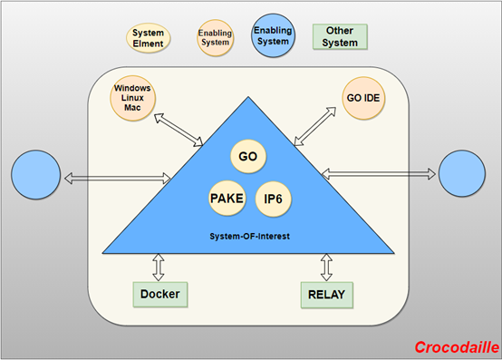

# Project topic part 
* [Croc](https://github.com/schollz/croc) **"The picked topic"**
* [MeiliSearch](https://github.com/meilisearch/MeiliSearch)
* Front end checklist
* Tabler
* mailcheck.js
* zoom sample web app: web.SDK

> This is a group assignment. It must be completed before **09/13/2020**.
# Project Name: **Crocodaille**
Croc is a software that can safely transfer data and files from one computer to another.It uses a relay-assisted peer-to-peer transactions and end-to-end encryption via password-authenticated key exchange. This allows data to be shared fast, easy and most importantly secure.

## Team Members - The Reptiles
* Adam Mills
* Zexi Xing
* Ernesto Macias
* Zidong Liu
* Dennis Ugebor
 
## Hypothetical working environment
The users well expect full functionality from their homes.Sender and receiver will  have full access to what's going on simultaneously. 

* **Scenario 1: Home Setting**  
  Basic file sharing utilization amongst peers located within the same network domain.  Priorities include ease of use, speed, and security, although all 3 are not weighted in     the same. Home users love speed and ease, but are at times less concerned about security features than an enterprise application would need as files are more focused on         entertainment and pictures.  
  _Threats_: network sniffing, unauthorized wifi access, man-in-the-middle attack, flooding attack, relay server vulnerabilities(SMTP, spoofing)  
  
* **Scenario 2: Small Business Setting**  
  File sharing (database files, payroll/tax spreadsheets, confidential documents) amongst employees in a small business environment still located within the same network but       possibly not in the same building.  Speed and ease of use still remain prominent priorities but the security of transfer is emphasized due to the types of documents being       sent. 
  _Threats_: network sniffing, unauthorized intranet access, targeted attacks, IoT attacks, cypher-text only attack, database leaks, relay server vulnerabilities (SMTP,           spoofing)  
  
* **Scenario 3: Student/Academic Setting**  
  File sharing amongst scholars but each scholar may be on an entirely different network or on the same network (one scholar could be on the University campus, the other at       home). Priorities remain focused on ease of use, speed, and security. Documents include potentially sensitive research for large or governmental institutions. 
  _Threats_: network sniffing, unauthorized intranet access, targeted attacks, database leaks, relay server vulnerabilities (SMTP, spoofing)

 
 
## System Engineering view 

// comments // [Here is the diagram, we need some elements to fill it](https://app.diagrams.net/#G1dM6GIznB1-VK59FLAiuCRJD4FGg0EHIf)  
// comments // we can modify this diagram and add our enabling system, system element and other system. It shouldn't be too hard
 

## Threats in Operational Environment
                    
1. IP protocol
2. Cross-platform system
3. Relay
4. Malicious code field
5. Transfer malicious file
6. Decrypt the encrypted file

## List of security features 

* Password authenticated key exchange (PAKE) for encrypted transmission
* Passcode authentication for file transfer

## Team Motivation

As our team first met, we collaborated to search through various github projects to find inspiration.  We even parsed through examples of previous class’ topic choices.  This helped us to narrow down what we wanted to work on. Based on the above evaluation, we found a program called Croc on github and decided it was for us.  Croc interested us because it seems like the perfect size for a repository for our assignment, it is not too big, but also not too small, and seems to have a very active contributor base.  Written primarily in GO, and focusing on network file transfers, the project also seems inviting and interesting to our team members based on our prior knowledge and tastes.

## Project Description 

The project is an open source project that enables us to transfer data to one computer to another, **simultaneously**. Using a safe and secure function called **crocodile**. One user invokes the program, selects a file, and chooses a passcode. A second user can then invoke croc using the identified passcode and receive the intended file.  In the project documentation, three key attributes are stressed as fundamental attributes of croc: its ease of use, its safety, and its speed. Crocodile is function(algorithm) that uses a three step **transaction** process:
1. relay-assisted peer-to-peer 
2. end-to-end encryption 
3. via password-authenticated key exchange
 
 
## License Summary and Contributor Agreement

Croc operates under the MIT open source license. This is a highly permissive license which adds only a few stipulations to the usage of the project, such as any usage of this code should also include the license, thus making any iteration of this code also highly permissive. This high level of permissiveness allows the MIT license to be compatible with other types of licenses. In this case, Croc only cites MIT as a license. 
 
## Software History 
* **Peer-to-peer** networks often utilize relay nodes to provide various networking services. These services include the traversal of Network Address Translator (NAT), content     search , application level multicasting and medium caching ..

* **End-to-end encryption** is a system of communication where only the communicating users can read the messages. In principle, it prevents potential eavesdroppers – including   telecom providers, Internet providers, and even the provider of the communication service – from being able to access the cryptographic keys needed to decrypt the conversation

* **Password-authenticated key exchange** are two entities, who only share a password, and who are communicating over an insecure network, want to authenticate each other and     agree on a large session key to be used for protecting their subsequent communication. This is called the password-authenticated key exchange problem.
 
## [Github Link](https://github.com/ZexiXin/CYBR8420.git)

 
## Teamwork Reflection

Unfamiliar with the overall project process. At the beginning, we were in a state of no goals. The biggest reason was that we had not yet chosen a topic, but after our long meeting, after each of us spoke our own ideas, we found that we all agreed with each other’s thoughts and suggestions. The process of the entire project has slowly become clear finally.

It is difficult to choose the topic of the project, because each of us has a topic of interest. This project is relatively new for us and requires constant reflection and choice. In the end, Croc was selected because this topic has the functions of transmission and reception. In the transmission and reception, we may imagine attacks in many situations.

It’s difficult to draw a diagram because we don’t understand how the elements inside are structured. Finally, we resolve it by consulting class documents and group meetings.
We come from all over the world and it is this project that connects us together. We all have a heart that loves to explore the online world, and also like to explore vulnerabilities in software. We believe that as long as we continue to explore it, all problems can be solved with our hands! Just like the name of our team, Crocodaille, looks calm on the surface, but actually hides huge energy.

We come from all over the world and it is this project that connects us together. We all have a heart that loves to explore the online world, and also like to explore vulnerabilities in software. We believe that as long as we continue to explore it, all problems can be solved with our hands! Just like the name of our team, Crocodaille, looks calm on the surface, but actually hides huge energy.

