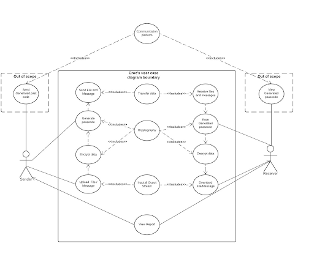
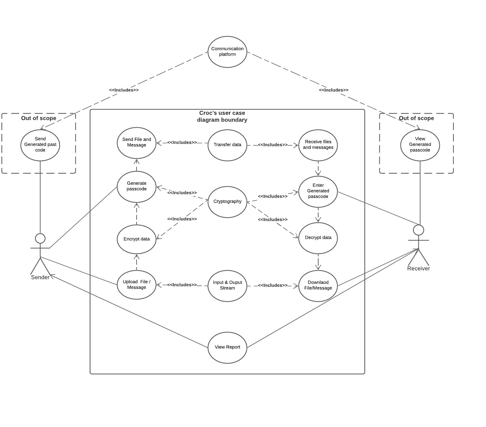

# Requirement of Software Security Engineering

### Part 1: 
* Identify 5 essential interactions from Crocdeile application.

  

* Misuse case analysis
  1. Sender uploads file/message VS attacker either spoofs or listens in file choice(Dong).
  
  2. Sender chooses passcode VS attackers attempts to upload his own malicious document, then sends code to malicious document to unsuspecting users.
  3. User view reports VS attacker modifies the report by embedding backdoors
  4. Receiver enters generated passcode VS attacker attempts to get remote control and gather data on users.
  5. Receiver attempts to download file VS attacker attempts to change/swap file.

### Part 2: 
* Review OSS project documentation for security-related configuration and installation issues

* Internal collaboration link:
[Google doc shared folder](https://docs.google.com/document/d/1RNjo0B2nqTEVmV74BUeL3rUyLTpLzrr7ZCfBDvtYeYs/edit)
[Github project board](https://github.com/ZexiXin/CYBR8420/projects/1)

* Reflection of teamwork for SSE assignement
  At the beginning, we had doubts about five essential interactions of our open-source software. Just a simple list of 5 points, without expansion. 
  The most fundamental reason is that we have not thoroughly understood the overall software process. After that, each of us came to a conclusion after using the Croc software.
  Some of the issues that occurred were identifying proper misuse cases for the diagrams and identifying the treat level of each diagram.

  Since the project proposal was not good enough last time, I think each of us must devote 100% of our energy to face our project this time. 
  We are a team, I believe that the ability of a team can be competent for any of us.

