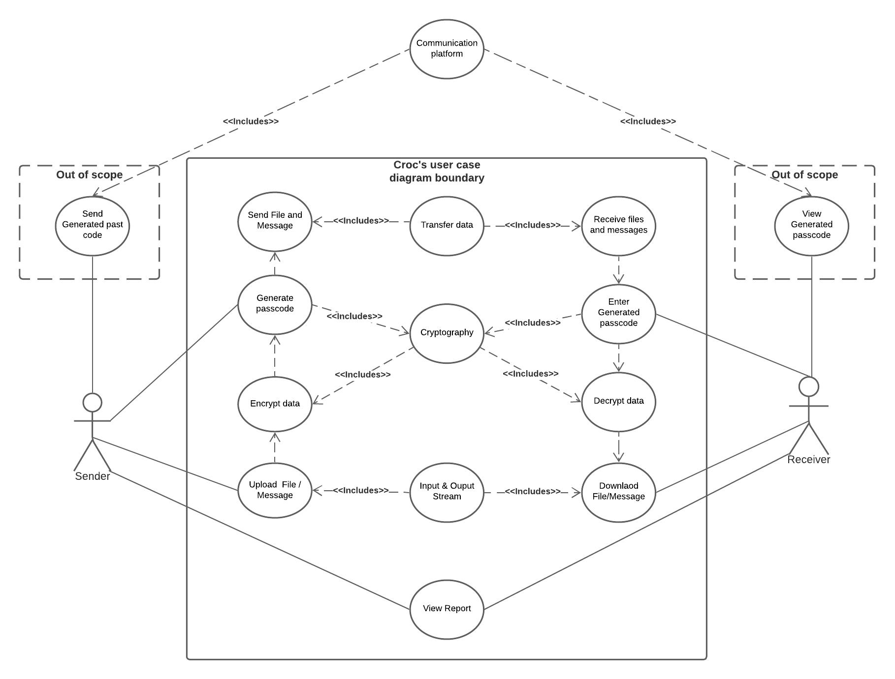
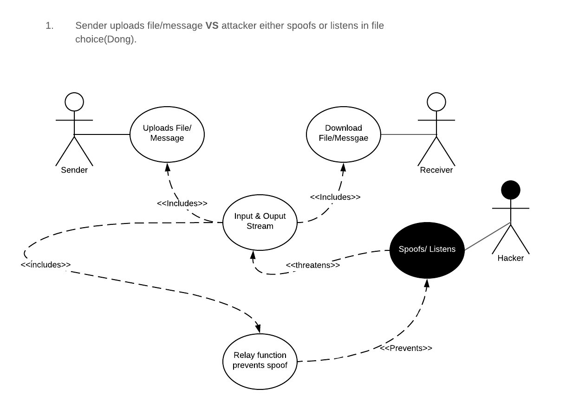
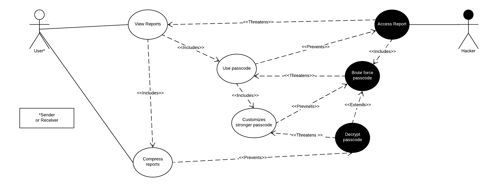
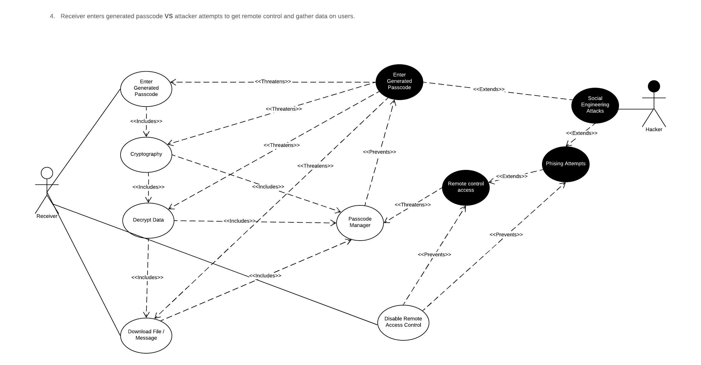

# Requirement of Software Security Engineering

### Part 1: 
* Identify **5 essential** interactions from Crocdeile application.

  

* Misuse case analysis
  1. Sender uploads file/message **VS** attacker either spoofs or listens in file choice.
  
  
  2. Sender chooses passcode **VS** attackers attempts to upload his own malicious document, then sends code to malicious document to unsuspecting users. 
  
  
  3. User view reports **VS** attacker modifies the report by changing the app source code and embedding backdoors.
  
  
  
  **Assess misuse case along with the OSS project:** After reviewing documentation and codebase of the OSS project, there are some basic security functions in the Croc that can   prevent several malicious movements. In the above misuse case, the user is trying to view the report as we described in the user diagram. Similarly, the hacker wants to         grant unauthorized access to the user’s report, so to prevent hackers access, the Croc app does provide a passcode mechanism to assist users to protect the confidentiality of   reports. In this case, hackers can brute force users' passcode which threatens the security of passcodes. Fortunately, Corc allows users to customize their own complicated     passcode, so using brute force is hard to break the stronger passcode. Generally, hackers will stop accessing users’ reports in this stage, but it is still possible for         hackers to decrypt the customized passcode. Therefore, the report can be actually compressed by Croc. In other words, even though hackers can break the stronger passcode, the   compress process prevent hacker to access file.
 
  
  4. Receiver enters generated passcode **VS** attacker attempts to get remote control and gather data on users.
  
  5. Receiver attempts to download file **VS** attacker attempts to change/swap file.

* Assess alignment of security requirements derived from mis-use case analysis with advertised features of the open-source software. Review OSS project documentation and         codebase to support your observations. 

### Part 2: 
* Review OSS project documentation for security-related configuration and installation issues. Summarize your observations.

* Internal collaboration link:  
  [Google doc shared folder](https://drive.google.com/drive/folders/1KaGGMMrWPBGJOGmv-B71ekzhYPtE84PG)  
  [Github project board](https://github.com/ZexiXin/CYBR8420/projects/1)

* Reflection of teamwork for SSE assignement

  At the beginning, we had doubts about five essential interactions of our open-source software. Just a simple list of 5 points, without expansion. 
  The most fundamental reason is that we have not thoroughly understood the overall software process. After that, each of us came to a conclusion after using the Croc software.
  Some of the issues that occurred were identifying proper misuse cases for the diagrams and identifying the treat level of each diagram. Among them, professor helps us           point out the mistakes of the miuse cases. Our instructor stated the misuse cases ought to focus on the System-of-Interest. Hence, misuse diagrams and its secrity defenses     have to stay with software itself.
  
  When we encountered assessing alignment of security requirements, we had a little doubt. At first, our idea was to explore some extra resources or other tools that can help     us to maintain the security of Croc, and then we understood we should start from the software itself and use misuse cases to evaluate security requirements.

  Since the project proposal was not good enough last time, I think each of us must devote 100% of our energy to face our project this time. 
  We are a team, we believe that the ability of a team can be competent for any of us.
  
  In the future, we need to pay more attention to the problems of the software itself. Sometimes we think the problems are too complicated. In fact, focusing on the software     itself is the best.
