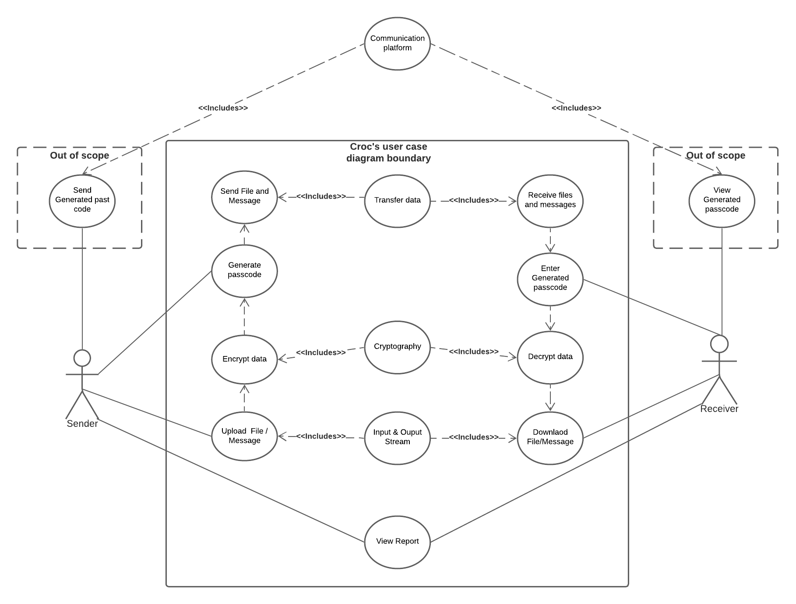

# Requirement of Software Security Engineering

### Part 1: 
* Identify **5 essential** interactions from Crocdeile application.

  

* Misuse case analysis
  1. Sender uploads file/message **VS** attacker either spoofs or listens in file choice(Dong).
  
  
  2. Sender chooses passcode **VS** attackers attempts to upload his own malicious document, then sends code to malicious document to unsuspecting users. (Adam)
  
  
  3. User view reports **VS** attacker modifies the report by changing the app source code and embedding backdoors (Xing)
  
 
  4. Receiver enters generated passcode **VS** attacker attempts to enter random passcode or stolen Passcode. (Dennis)
  
  
  5. Receiver attempts to download file **VS** attacker attempts to change/swap file.

* Assess alignment of security requirements derived from mis-use case analysis with advertised features of the open-source software. Review OSS project documentation and         codebase to support your observations. 

1. Sender uploads file/message **VS** attacker either spoofs or listens in file choice(Dong).

   Spoof often occurs between clients, just like when we send files, through the data terminal, then hackers can use spoof to obtain useful information. But croc avoids 	    this very well. By observing the OSS project documentation and codebase. I found that there is a particularly useful function. That is relay. It not only achieves 		    safety, but also ensures the transmission rate. There are better ways than sequentially uploading and downloading. Instead, you can use a relay server to create a full-        -duplex real-time communication layer between the two computers so that “uploading” and “downloading” occur simultaneously between the two computers.
 
2. Sender chooses passcode **VS** attackers attempts to upload his own malicious document, then sends code to malicious document to unsuspecting users. (Adam)
	
	In this scenario, the attacker is attempting to download the uploaded file from the sender.  However, he is not the intended recipient of the file, and as such have the appropriate passcode.  Because of this, his attempts to download the file is rejected.  Upon entering the wrong passcode, the system does not associate what the attacker types in with the file he desires.

3. User view reports **VS** attacker accesses the report and decrypt report's passcode (Xing)

   After reviewing documentation and codebase of the OSS project, there are some basic security functions in the Croc that can prevent several malicious movements. In the 	    above misuse case, the user is trying to view the report as we described in the user diagram. Similarly, the hacker wants to grant unauthorized access to the user’s 	    report, so to prevent hackers access, the Croc app provides a passcode mechanism to assist users to protect the confidentiality of reports. In this case, hackers can 	    brute force users' passcode which threatens the security of passcodes. Fortunately, Corc allows users to customize their own complicated passcode, so using brute force is      hard to break the stronger passcode. Generally, hackers will stop accessing users’ reports in this stage, but it is still possible for hackers to decrypt the customized        passcode. Therefore, the report can be actually compressed by Croc. In other words, even though hackers can break the stronger passcode, the compress process prevent hacker    to access file.
  
4. Receiver enters generated passcode **VS** attacker attempts to get remote control and gather data on users.
 

5. Receiver attempts to download file **VS** attacker attempts to change/swap file.

### Part 2: 
* Review OSS project documentation for security-related configuration and installation issues

	1. [Test fails issue](https://github.com/schollz/croc/issues/218)
	
	   In this issue flagged on Croc's github repository, the user commented that, while trying to create a version of Croc that would install and run on Alpine Linux, 
	   he could not get it to function.  His own personal PC runs 32bit Linux but the test bench he seeks to install it on is on s390x (64 bit). The thread remains 		   unresolved. The owner/main contributor responded at some point, and the most recent comment is 6 days ago.  The most recent comment suggests looking into the 		   relationships between the systems and how they handle byte ordering.
	
	2. [Http issue](https://github.com/schollz/croc/issues/270)
	
	   Some networks only allow outbound connections through HTTP proxy servers. Some users have been banned during the use of the port, resulting in the inability to use 		   Croc normally. For example, a user institutional firewall / proxy and the port 9009 is blocked happened in his work environment. In fact, a big reason for this is 	 	    caused by the relay, which requires compliance with the rules. There are better ways than sequentially uploading and downloading. Instead, using a relay server to 	  	     create a full-duplex real-time communication layer between the two computers and allows any two computers to connect to one another without resorting to port 	   	      forwarding or fiddling with a server.
	
	3. [Permission denied issue](https://github.com/schollz/croc/issues/275)
	   
	   A **Croc** user has reported a permission denied problem while he is trying to send an empty file from Windows system to Linux system. The main contributor denotes              it is hard to fix this problem because snapd daemon doesn’t have access to those dot-files in home directory, Hence, the user has to take advantage of a **Croc**                function which can specify the receive directory while sending files. However, we noticed there is another problem. Let say if the sender can specify a directory to            receive file, it means that directory must allow the outside access, and this outside access could bring security issues to the receiver machine. In other words,                specifying the directory might increase the risk of causing security problems on the receiver device.   
	   
	   In the above case, the main contributors advise the user to specify **/tmp** directory in Linux system to receive files, but in Linux **/tmp** contains many                    important files that support currenting running programs. Normally, the directory won’t contain more than **a few kilobytes**. Therefore, if sender transfers a very            large file into this directory, it might impact the performance of receiver’s system or crash the system.

	
	4. [Passcode Authentication:](https://github.com/schollz/croc/issues/237#) 
	Another security related issue was logged approximately 24 days ago with the subject “Better UX for wrong password with issue #237. The issue is related to passcode 		authentication but the user was able to detect that Croc error message concerning the passcode authentication attempt failed attempt message reads “connecting...[error]	2020/09/03 21:17:41 croc.go:565: ips unmarshal error: invalid character '\x01' looking for beginning of value securing channel...[error]	2020/09/03 21:17:42 		compress.go:46: error copying data: unexpected EOF problem with decoding: unexpected end of JSON input”
	
	According to the issue log, this messaging needed to be corrected and updated accordingly to enable user better optimize Croc. The user suggestion was to have Croc,
	display a short error message “invalid or wrong password” which enable users to clearly distinguish the cause of the issue.

	
	5. something

* Internal collaboration link:  
  [Google doc shared folder](https://drive.google.com/drive/folders/1KaGGMMrWPBGJOGmv-B71ekzhYPtE84PG)  
  [Github project board](https://github.com/ZexiXin/CYBR8420/projects/1)

* Reflection of teamwork for SSE assignement

  At the beginning, we had doubts about five essential interactions of our open-source software. Just a simple list of 5 points, without expansion. 
  The most fundamental reason is that we have not thoroughly understood the overall software process. After that, each of us came to a conclusion after using the Croc software.
  Some of the issues that occurred were identifying proper misuse cases for the diagrams and identifying the treat level of each diagram. 
  Among them, thank you the professor for helping us point out the mistakes of the misuse cases, and we must focus on the software itself and what it can defend against.

  When we encountered the "assess the alignment of security requirements", we were originally confused about what they entailed. At first, our idea was to find the software 	   description, 
  and then we understood that we should start from the software itself and use misuse cases to evaluate security requirements.
  
  
  In our view, the grade for the project proposal assignement was as high as we would have liked, so moving forward each of us must devote more of our energy to this project in   the future. 
  We are a team, I believe that the ability of a team can be competent for any of us.

  In the future, we need to pay more attention to the problems of the software itself. Sometimes we think the problems are too complicated, but, if you focus on the software 	   itself rather than the enviroment in which it runs, then it is much easier to understand.
